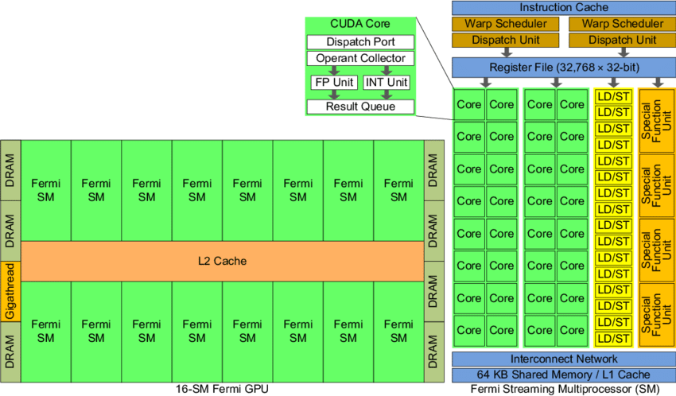

# GPU Hardwar model

Any specific numbers probably will be for my GeForce 1060 6GB card ([specs](https://www.nvidia.com/en-us/geforce/10-series/) and a [good article](https://wccftech.com/nvidia-geforce-gtx-1060-final-specifications/)).
This has [compute capability](https://people.maths.ox.ac.uk/gilesm/cuda/lecs/lec1-2x2.pdf) of 6.1 (see these [tables](https://developer.nvidia.com/cuda-gpus#compute)).

A lot of this info comes from Nvidia's Fermi archtecture whitepaper. See [here](https://www.nvidia.com/content/PDF/fermi_white_papers/NVIDIAFermiComputeArchitectureWhitepaper.pdf) or [here](./assets/fermi_whitepaper.pdf).




At the highest level, an Nvidia GPU contains,

* The global DRAM memory. This is the memory number advertised (6GB).
* A global (on the device) L2 cache of 1536KB.
* 10 streaming multiprocessors (SM)
* A "GigaThread" global scheduler

## GigaThread

When the host CPU invokes a GPU kernel with a grid of blocks, the GigaThread (or global scheduler) passes each of those blocks to a SM that has capacity. Each SM can execute multiple thread blocks concurrently, but all lower level scheduling is handled by the SM.

## Streaming Multiprocessors

Each of the [multiprocessors](https://docs.nvidia.com/cuda/cuda-c-programming-guide/#compute-capability-6-x) contains both processing cores, and some local memory.

Processing
* 128 CUDA cores (or streaming processors) for arithmetic operations
* 32 special function units for transcendental function
* Some load/store units
* 4 warp schedulers

Memory
* 48 KB L1 cache of global memory
* 96 KB of shared memory
* Local registers for local memory
* A read-only constant cache, which speeds up (caches) reads from the device's constant memory.

### CUDA cores

Each cuda core contains a pipelined integer (ALU) and floating point (FPU) arithmetic unit. These can execute "standard" instructions - add, multiple, fused multiply-add, bit shift, etc.

While pipelining gives us instruction level parallelism, other performance enhancements such as out of order execution and branch prediction are generally not there. See [here](https://docs.nvidia.com/cuda/cuda-c-programming-guide/index.html#control-flow-instructions) for some cases where we might get branch prediction and general performance suggestions. Also not that the *compiler* can reorder instructions, however the SM will not change that order. This is unlike CPUs where the instructions can be [reordered](https://en.wikipedia.org/wiki/Out-of-order_execution#Out-of-order_processors) at run time
Also note that ILP can only be taken advantage of if the instructions are independent. E.g. in the following example the first two instructions are independent and can be executed in parallel. However, the third needs to wait for them to finish before it can be started.

```
c = a + b
d = e * f
h = c + d
```


Also note that different operations have wildly different throughput (and this can change of different hardware). See [this table](https://docs.nvidia.com/cuda/cuda-c-programming-guide/index.html#arithmetic-instructions__throughput-native-arithmetic-instructions), but some examples of number of results per clock cycle per SM:
* 128 single precision floating point operations (i.e. 1 clock cycle each as there ase 128 CUDA cores per SM)
* 4 double precision and only 2 half precision!
* 32 single precision floating point sin/cos/sqrt

If Small loss of precision can be tolerated, explore using `-use_fast_math`, or explicitly using the faster function.

### Special function units (SFU)

The SFU are responsible for functions such as sin, cos, sqrt.


### Load store units

The data that is being operated on needs to be pulled into registers from global/L2 memory. This is done by load/store units

### Warp schedulers

See [CUDA docs](https://docs.nvidia.com/cuda/cuda-c-programming-guide/#hardware-implementation)

While we *logically* have a grid of blocks each containing some threads, the hardware has another hierachical level: the warp. The SM splits the threads in a block into warps of 32 threads. Individual threads within a warp start at the same program address. However, each thread has its own local memory (stored in the registers) and instruction address counter - they can store their own local variables, do not execute the same code, and so can branch and execute independently.

However, while the threads within a warp do not execute the same code, the warp can only execute one instruction at a time. For example if half the warp wants to go down the left side of a branch and the other half wants to go down the right, the warp will first process the instructions from the left (with half the threads marked as *inactive*) and then the instructions from the right (with the other half now *inactive*). The effectively halves the parallelism of the GPU.
The logical `threadsPerBlock` should also be chosen to be a multiple of the warp size to minimize the number of empty threads. Imagine a worst case where `threadsPerBlock=1`. This would mean that each warp has 1 thread running and 31 inactive.

This also marks a slight difference between the CUDA *SIMT* (where T is threads) and the usual SIMD. I'm not sure I fully understand this, but basically for performance there are some things you need to be careful of (e.g. too much branching) in SIMT, but also some advantages (easier to write code for?).

Switching between warps is very low cost. As all information (program counter, registers) is kept on the SM, at each instruction execution time, the warp scheduler can assign a given warp to have its active threads execute. As there are 4 of these, 4 warps can execute concurrently (makes sense - 32 threads per warp, 128 cores per SM).
Separate warps are still fully pipelined.
Note that, assuming neighbouring instructions rely on each other and so cannot be pipelined, and that each instruction takes 4 clock cycles, you need at least 16 warps (4 schedulers, 4 clock cycles) active to fully utilize the SM. This number would be reduced if each warp could be pipelined (potentially down to the number of schedulers) but dramatically increased if warps need to wait for non-local memory access. [See](https://docs.nvidia.com/cuda/cuda-c-programming-guide/index.html#multiprocessor-level).

The limit to the number of warps that can run concurrently is the amount of register space. It sounds like the compiler knows how much each thread needs and won't schdule more warps. As more warps can dramatically increase performance (see above and below where we talk about the slow access to global memory), keeping per thread register requirements low and thus allowing more warps to be scheduled can improve performance.


## Global DRAM and L2

### Transfers betwee host and device

These are often the slowest parts of a kernel. The hard, unbeatable limit is enforced by the PCIe transfer bandwidth. This is (assuming PCIe 3.0 x16) 16GB/s. However, there are other factors that can make us not hit this.

Normal, [pageable](https://en.wikipedia.org/wiki/Paging), memory cannot be transferred to the device using direct memory access ([DMA](https://en.wikipedia.org/wiki/Direct_memory_access)]). So, the process of getting memory onto the GPU starts with a copy from pageable to non-pageable memory, followed by a DMA to the GPU (e.g. [here](https://devblogs.nvidia.com/how-optimize-data-transfers-cuda-cc/)). If we know we need to send the memory to the GPU, assign non-pageable memory in the first place. Of course this comes with the caveat that you are more likely to run out of memory...

There is also some overhead to each transfer, so many small transfers will be slower than a single large one.

We can confirm that PCIe is the limiting factor, and not our RAM.  Let's say we have dual channel (two stick) DDR4-2400 (double data rate @ 1200Mhz. The 2400 stands for Mtransfer/s). The data rate is therefore

```
dual_channel * frequency * ddr * bus_size = 2 * 1.2 G * 2 * 8B ~ 40GB/s
```

Which is much larger than the PCIe bandwidth.

### Global Memory

The device's global memory is not a single DRAM chip. However, we know that the memory is GDDR5/X which has a transfer rate of 8Gb/s or 1GB/s. It also has a bus size of 32 bits, meaning that each DRAM chipe can actually transfer 32GB/s. The specs show that the overall memory interface width is 192, which suggests that there are 6 DRAM chips. This is confirmed by [this](https://cdn.arstechnica.net/wp-content/uploads/sites/3/2016/07/GeForce_GTX_1060_Block_Diagram_FINAL_1467926505.png) and [this](http://cdn.wccftech.com/wp-content/uploads/2017/04/nvidia-geforce-gtx-1060-pcb-Custom.png). Overall memory bandwidth is therefore,

```
n_dram_chips * speed_of_gddr5 * bus_size_gddr5 = 6 * 1GB/s * 32 = 192 GB/s
```

So, once we have the data on the device, we can pump it fast! We therefore really want to avoid excess transfers to and from.


### Transfers between global memory and SM

The most common reason why a SM will sit idle is that the data needed for the next instruction of all the warps is not there. Accessing global memory takes hundreds of clock cycles. This is not terrible if you have lots of warps running - the warp requesting memory can just wait!
